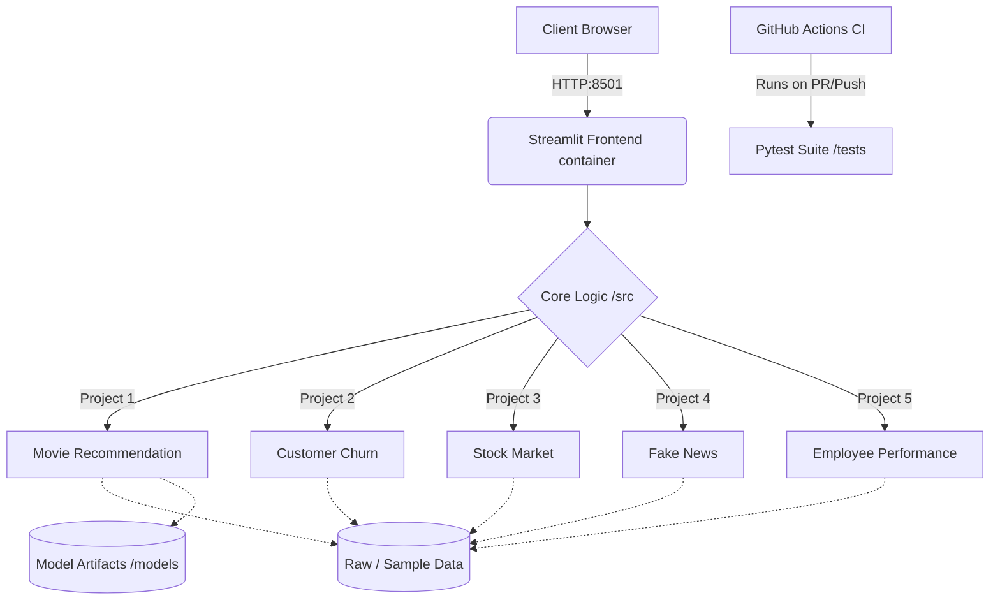

# Data Science / ML Internship Portfolio

This repository implements five end-to-end Machine Learning projects, built with a strong focus on *Monozukuri* (craftsmanship), predictable architecture, and graceful failure handling.

1. Movie Recommendation System
2. Customer Churn Prediction
3. Stock Market Trend Analysis
4. Fake News Detection System
5. Employee Performance Prediction Model

The application architecture relies on robust testing, containerization, and Continuous Integration (CI) to ensure enterprise-grade resilience and reproducibility. All network and file operations fail gracefully to ensure uninterrupted user experience.

---

## 🏗️ System Architecture



---

## 🚀 Setup Instructions

We use Docker to ensure the environment is fully agnostic and works reliably out-of-the-box.

### 1. Run via Docker (Recommended)

```bash
# Build and start the container in detached mode
docker-compose up --build -d

# The application is now available at http://localhost:8501
```

### 2. Run via Local Virtual Environment

```powershell
python -m venv .venv
.\.venv\Scripts\Activate.ps1
pip install -r requirements.txt
$env:PYTHONPATH="src"
streamlit run app.py
```

---

## 📦 Dependency Rationale

- **Streamlit**: Selected for the frontend to rapidly iterate on data applications without context-switching to JavaScript/React. It allows the Python backend and frontend to stay within the same ecosystem.
- **Pytest**: Chosen for the testing framework due to its rich feature set, easy fixtures, and strict enterprise adoption. 
- **Docker & Docker Compose**: Used to encapsulate the environment to prevent "it works on my machine" issues.
- **Pandas / Scikit-Learn**: Industry standard for data manipulation and classical ML modeling, ensuring maximum maintainability and predictability.

---

## 🧪 Testing & CI/CD

Robustness is enforced via GitHub Actions (`.github/workflows/ci.yml`). Every commit triggers a full test suite:

```powershell
$env:PYTHONPATH="src"
pytest
```

---

## 📂 Project Structure

Following Wabi-Sabi principles for a predictable, explicit layout:

```text
/src/                          Core business logic and ML pipelines
/tests/                        Comprehensive unit and integration tests
/.github/workflows/            CI/CD automation definitions
Dockerfile                     Container definition for the app
docker-compose.yml             Local cluster orchestration
app.py                         Entry point for the Streamlit dashboard
data/                          Raw datasets and fallbacks
models/                        Trained serialized models
```

---

## 📊 Dataset Links

- MovieLens 100K: https://grouplens.org/datasets/movielens/100k/
- Telco Customer Churn: https://www.kaggle.com/datasets/blastchar/telco-customer-churn
- Stock data: https://ranaroussi.github.io/yfinance/
- LIAR fake news dataset: https://aclanthology.org/P17-2067/
- IBM HR Analytics: https://www.kaggle.com/datasets/pavansubhasht/ibm-hr-analytics-attrition-dataset

*Note: All public datasets can be downloaded automatically via `python scripts/download_public_data.py`. Kaggle datasets require manual download or an API token.*

---

## ✅ Operations & Checklist

- Dataset status can be verified with `python scripts/check_data_sources.py`
- Train all models systematically with `python scripts/train_all.py`
