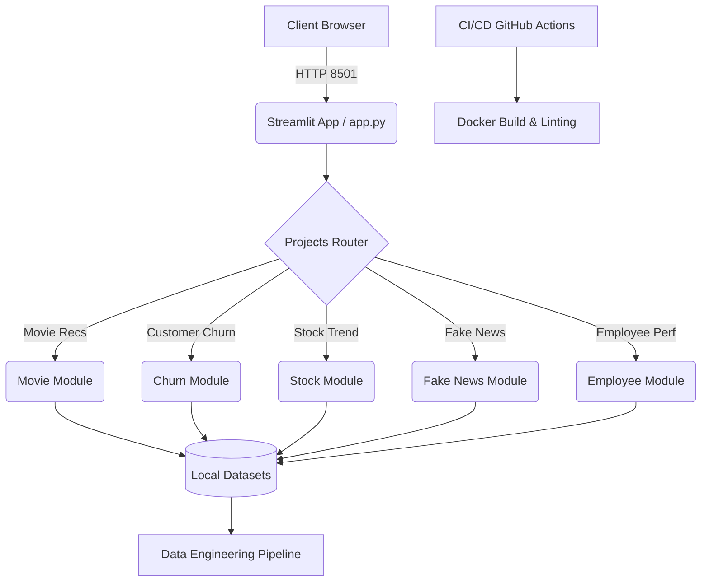

# ML Internship Portfolio

An end-to-end Machine Learning ecosystem showcasing multiple models packaged into a Streamlit application. Designed with structural integrity, continuous integration, and containerization.

## Architecture Diagram



## Setup Instructions

### 1. Using Docker Compose (Recommended)

1. Ensure [Docker](https://docs.docker.com/get-docker/) and [Docker Compose](https://docs.docker.com/compose/install/) are installed.
2. Clone this repository:
   ```bash
   git clone <repo-url>
   cd ml-internship-portfolio
   ```
3. Run the complete ecosystem:
   ```bash
   docker-compose up --build
   ```
4. Access the web interface at: `http://localhost:8501`

### 2. Manual Setup (Python Environment)

1. Ensure Python 3.10+ is installed.
2. Install the required dependencies:
   ```bash
   pip install -r requirements.txt
   ```
3. Set the Python path:
   ```bash
   export PYTHONPATH="src"
   ```
4. Run the application:
   ```bash
   streamlit run app.py
   ```

## Dependency Rationale

- **streamlit**: Core web framework chosen for its rapid UI building capabilities tailored for data science workflows.
- **pandas & numpy**: Standard data manipulation foundations. High performance for vectorized operations.
- **scikit-learn**: Main machine learning library providing robust models and evaluation metrics without heavy dependencies.
- **pytest**: For comprehensive smoke tests and unit testing, ensuring reliability.
- **flake8**: Enforces code style and complexity constraints across the codebase.

## Ecosystem Principles

- **Predictable Commit History**: Enforced Conventional Commits.
- **Fault-Tolerant Execution**: All core logic paths implement robust exception tracking and handling to prevent silent failures.
- **Architectural Clarity**: Clear separation of operational concerns (`/src` for source logic, `/tests` for evaluation, root for entry points).
