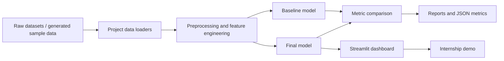

# Data Science / ML Internship Portfolio Final Report

Prepared by: Praj  
Project type: Five-project ML internship portfolio  
App: Streamlit  
Repository: `urlr`

## 1. Executive Summary

This portfolio implements five machine learning projects:

1. Movie Recommendation System
2. Customer Churn Prediction
3. Stock Market Trend Analysis
4. Fake News Detection System
5. Employee Performance Prediction Model

Each project includes a reusable Python pipeline, dashboard page, model metrics, testing path, and deployment-ready Streamlit integration. All five projects now use real downloaded datasets from `data/raw/`. The generated sample-data fallback remains in code only to keep the demo functional if a local dataset is removed.

## 2. System Architecture



## 3. Project Summaries

### 3.1 Movie Recommendation System

Problem: Users need personalized movie suggestions from a large catalog.

Dataset: MovieLens 100K is downloaded from GroupLens and detected automatically from `data/raw/ml-100k`.

Modeling:

- Baseline: movie popularity / average rating
- Final: matrix factorization using Truncated SVD

Dashboard:

- User ID selector
- Top-N recommendation count
- Recommended movies table
- Baseline vs final model metrics

### 3.2 Customer Churn Prediction

Problem: Retention teams need to identify customers likely to cancel.

Dataset: IBM/Telco churn CSV downloaded into `data/raw/Telco-Customer-Churn.csv`.

Modeling:

- Baseline: Logistic Regression
- Final: Random Forest classifier

Dashboard:

- Customer risk scoring form
- Churn probability and risk tier
- Highest-risk customer table
- Precision, recall, F1, and ROC-AUC metrics

### 3.3 Stock Market Trend Analysis

Problem: Analysts need a repeatable way to classify market trend regimes and compare strategy behavior.

Dataset: Real OHLCV data downloaded through `yfinance` and saved as `data/raw/stock_ohlcv.csv`.

Modeling:

- Baseline: moving-average signal
- Final: Random Forest trend classifier

Dashboard:

- Ticker selector
- Candlestick chart with moving averages
- Trend model metrics
- Backtest-style cumulative return chart

Disclaimer: The output is educational only and is not investment advice.

### 3.4 Fake News Detection System

Problem: Users need assistive flagging for potentially misleading news text.

Dataset: Fake/Real News CSV downloaded into `data/raw/fake_or_real_news.csv`.

Modeling:

- Final: TF-IDF vectorizer with Logistic Regression

Dashboard:

- Free-text news checker
- Fake/real prediction
- Confidence score
- Sample scored text table
- Precision, recall, F1, and ROC-AUC metrics

Disclaimer: The system is assistive and cannot determine truth by itself.

### 3.5 Employee Performance Prediction Model

Problem: HR analysts need explainable decision-support for employee performance insights.

Dataset: IBM HR Analytics CSV downloaded into `data/raw/WA_Fn-UseC_-HR-Employee-Attrition.csv`.

Modeling:

- Baseline: Logistic Regression
- Final: Random Forest classifier

Dashboard:

- Employee scoring form
- High-performer probability
- Scored employee sample
- Model metrics and demographic parity difference

Disclaimer: The system is decision-support only and should not automate HR decisions.

## 4. Testing and Validation

The project includes automated smoke tests in `tests/test_projects.py`. These tests verify that:

- Movie recommendations return expected rows
- Churn prediction returns valid probabilities
- Stock model produces metrics and scored rows
- Fake news prediction returns a valid label and probability
- Employee prediction returns valid probabilities

Run tests:

```powershell
$env:PYTHONPATH="src"
python -m pytest -q
```

## 5. Training and Artifact Export

Train all models and generate metrics:

```powershell
$env:PYTHONPATH="src"
python scripts/train_all.py
```

Outputs:

- Model artifacts in `models/`
- JSON metrics in `reports/generated/`
- Markdown metric summary in `reports/generated/MODEL_METRICS.md`

The generated metric summary for the latest local run is available at:

- `reports/generated/MODEL_METRICS.md`

## 6. Deployment

Local deployment:

```powershell
$env:PYTHONPATH="src"
python -m streamlit run app.py
```

Recommended cloud deployment:

- Push the repository to GitHub
- Deploy on Streamlit Community Cloud
- Set the main file path to `app.py`
- Add dataset files manually or use sample fallback for demo

## 7. Limitations

- Large raw datasets are ignored by Git and should be downloaded locally before final training.
- Generated sample data remains as a fallback only and should not be used for final model claims.
- Transformer-based NLP and advanced explainability can be added as future improvements.
- Stock trend results are educational and should not be interpreted as trading advice.
- HR predictions require careful fairness review before any real organizational use.

## 8. Future Scope

- Add SHAP explanations for churn and employee models
- Add real yfinance download mode for stock project
- Add notebook exports for each project
- Add model cards for sensitive projects
- Deploy public Streamlit app and attach screenshots
